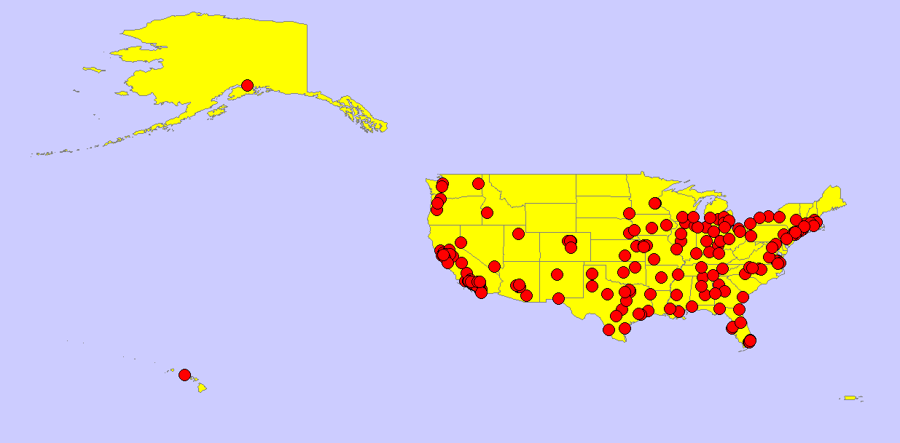
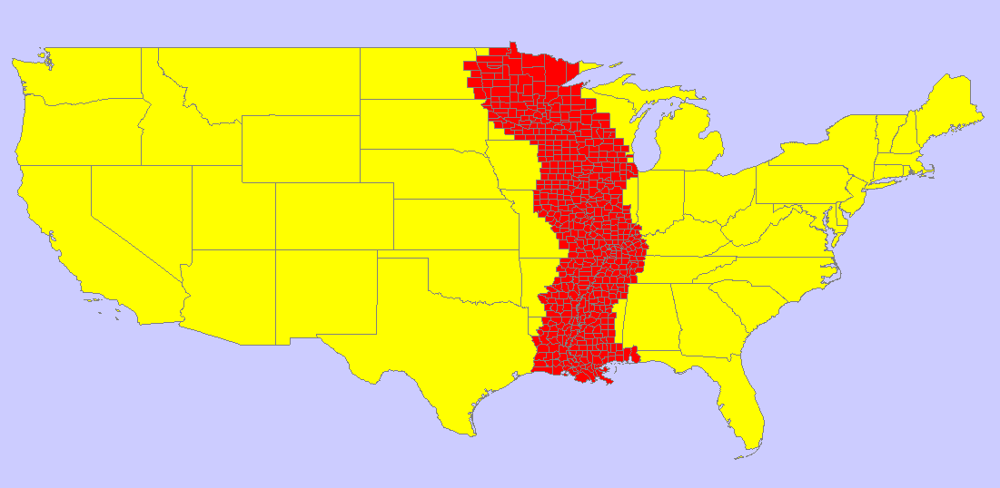
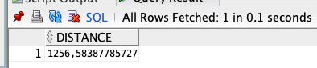

# Raport

# Przetwarzanie i analiza danych przestrzennych 
# Oracle spatial


---

Jacek Budny, Mateusz Kleszcz

--- 

Celem ćwiczenia jest zapoznanie się ze sposobem przechowywania, przetwarzania i analizy danych przestrzennych w bazach danych
(na przykładzie systemu Oracle spatial)

Swoje odpowiedzi wpisuj w miejsca oznaczone jako:

---
> Wyniki, zrzut ekranu, komentarz

```sql
--  ...
```

---

Do wykonania ćwiczenia (zadania 1 – 7) i wizualizacji danych wykorzystaj Oracle SQL Develper. Alternatywnie możesz wykonać analizy w środowisku Python/Jupyter Notebook

Do wykonania zadania 8 wykorzystaj środowisko Python/Jupyter Notebook

Raport należy przesłać w formacie pdf.

Należy też dołączyć raport zawierający kod w formacie źródłowym.

Np.
- plik tekstowy .sql z kodem poleceń
- plik .md zawierający kod wersji tekstowej
- notebook programu jupyter – plik .ipynb

Zamieść kod rozwiązania oraz zrzuty ekranu pokazujące wyniki, (dołącz kod rozwiązania w formie tekstowej/źródłowej)

Zwróć uwagę na formatowanie kodu

<div style="page-break-after: always;"></div>

# Zadanie 1

Zwizualizuj przykładowe dane

US_STATES


> Wyniki, zrzut ekranu, komentarz

```sql
SELECT * FROM US_STATES
```

> Wizualizacja przedstawia stany USA. Tabela ze stanami zawiera kolumny z opisem geometrycznym.


US_INTERSTATES


> Wyniki, zrzut ekranu, komentarz

```sql
SELECT * FROM US_INTERSTATES
```


> W tabeli przedstawione są drogi stanów zjednoczonych (nie ma żadnych dróg z Alaski i wysp, tylko z kontynentu). Tabela zawiera ID, nazwę oraz opis geometryczny.


US_CITIES


> Wyniki, zrzut ekranu, komentarz

```sql
SELECT * FROM US_CITIES
```



> Tabela ta zawiera 195 miast, każde jest przypiane do stanu oraz posiada swoją punktową lokalizację.

US_RIVERS


> Wyniki, zrzut ekranu, komentarz

```sql
SELECT * FROM US_RIVERS
```


> Tabela przedstawia 56 rzek w USA, są one wizualizowane w ten sam sposób co autostrady

US_COUNTIES


> Wyniki, zrzut ekranu, komentarz

```sql
SELECT * FROM US_COUNTIES
```


> Obszar USA podzielony na hrabstwa, przed wykonaniem query otrzymujemy warning o możliwym dużym zużyciu zasobów (3230 wierszy, każdy z nich ma swoją geometrię)

US_PARKS


> Wyniki, zrzut ekranu, komentarz

```sql
SELECT * FROM US_PARKS
```


> Tabela zawiera wszystkie parki w USA, jest to największa tabela (6331 wiersze), każdy park jest reprezentowany przez geometrię małych rozmiarów.

# Zadanie 2

Znajdź wszystkie stany (us_states) których obszary mają część wspólną ze wskazaną geometrią (prostokątem)

Pokaż wynik na mapie.

prostokąt

```sql
SELECT  sdo_geometry (2003, 8307, null,
sdo_elem_info_array (1,1003,3),
sdo_ordinate_array ( -117.0, 40.0, -90., 44.0)) g
FROM dual
```


> Wyniki, zrzut ekranu, komentarz

```sql
--  ...
```


Użyj funkcji SDO_FILTER

```sql
SELECT state, geom FROM us_states
WHERE sdo_filter (geom,
sdo_geometry (2003, 8307, null,
sdo_elem_info_array (1,1003,3),
sdo_ordinate_array ( -117.0, 40.0, -90., 44.0))
) = 'TRUE';
```

Zwróć uwagę na liczbę zwróconych wierszy (16)


> Wyniki, zrzut ekranu, komentarz

```sql
--  ...
```


Użyj funkcji  SDO_ANYINTERACT

```sql
SELECT state, geom FROM us_states
WHERE sdo_anyinteract (geom,
sdo_geometry (2003, 8307, null,
sdo_elem_info_array (1,1003,3),
sdo_ordinate_array ( -117.0, 40.0, -90., 44.0))
) = 'TRUE';
```

Porównaj wyniki sdo_filter i sdo_anyinteract

Pokaż wynik na mapie


> Wyniki, zrzut ekranu, komentarz

```sql
--  ...
```

# Zadanie 3

Znajdź wszystkie parki (us_parks) których obszary znajdują się wewnątrz stanu Wyoming

Użyj funkcji SDO_INSIDE

```sql
SELECT p.name, p.geom
FROM us_parks p, us_states s
WHERE s.state = 'Wyoming'
AND SDO_INSIDE (p.geom, s.geom ) = 'TRUE';
```

W przypadku wykorzystywania narzędzia SQL Developer, w celu wizualizacji na mapie użyj podzapytania

```sql
SELECT pp.name, pp.geom  FROM us_parks pp
WHERE id IN
(
    SELECT p.id
    FROM us_parks p, us_states s
    WHERE s.state = 'Wyoming'
    and SDO_INSIDE (p.geom, s.geom ) = 'TRUE'
)
```


> Wyniki, zrzut ekranu, komentarz


> Na mapie widzimy 32 parki, które w całości znajdują się bezpośrednio w stanie Wyoming USA.


```sql
SELECT state, geom FROM us_states
WHERE state = 'Wyoming'
```


> Wyniki, zrzut ekranu, komentarz


> Dzięki temu poleceniu możemy oznaczyć stan Wyoming na mapie USA.


Porównaj wynik z:

```sql
SELECT p.name, p.geom
FROM us_parks p, us_states s
WHERE s.state = 'Wyoming'
AND SDO_ANYINTERACT (p.geom, s.geom ) = 'TRUE';
```

W celu wizualizacji użyj podzapytania


> Wyniki, zrzut ekranu, komentarz


```sql
SELECT pp.name, pp.geom  FROM us_parks pp
WHERE id IN
(
    SELECT p.id
    FROM us_parks p, us_states s
    WHERE s.state = 'Wyoming'
    and SDO_ANYINTERACT (p.geom, s.geom ) = 'TRUE'
)
```


> Tym razem otrzymaliśmy 46 wierszy. Drugie użyte przez nas zapytanie zwraca parki, których jakakolwiek część leży w granicach stanu Wyoming, podczas gdy w pierwszym park musi zawierać się w całości w granicach.


# Zadanie 4

Znajdź wszystkie jednostki administracyjne (us_counties) wewnątrz stanu New Hampshire

```sql
SELECT c.county, c.state_abrv, c.geom
FROM us_counties c, us_states s
WHERE s.state = 'New Hampshire'
AND SDO_RELATE ( c.geom,s.geom, 'mask=INSIDE+COVEREDBY') = 'TRUE';

SELECT c.county, c.state_abrv, c.geom
FROM us_counties c, us_states s
WHERE s.state = 'New Hampshire'
AND SDO_RELATE ( c.geom,s.geom, 'mask=INSIDE') = 'TRUE';

SELECT c.county, c.state_abrv, c.geom
FROM us_counties c, us_states s
WHERE s.state = 'New Hampshire'
AND SDO_RELATE ( c.geom,s.geom, 'mask=COVEREDBY') = 'TRUE';
```

W przypadku wykorzystywania narzędzia SQL Developer, w celu wizualizacji danych na mapie należy użyć podzapytania (podobnie jak w poprzednim zadaniu)


> Wyniki, zrzut ekranu, komentarz

```sql
--  ...
```

# Zadanie 5

Znajdź wszystkie miasta w odległości 50 mili od drogi (us_interstates) I4

Pokaż wyniki na mapie

```sql
SELECT * FROM us_interstates
WHERE interstate = 'I4'

SELECT * FROM us_states
WHERE state_abrv = 'FL'

SELECT c.city, c.state_abrv, c.location 
FROM us_cities c
WHERE ROWID IN 
( 
SELECT c.rowid
FROM us_interstates i, us_cities c 
WHERE i.interstate = 'I4'
AND sdo_within_distance (c.location, i.geom,'distance=50 unit=mile'
)
```


> Wyniki, zrzut ekranu, komentarz


> Mamy 3 takie miasta


Dodatkowo:

a)     Znajdz wszystkie jednostki administracyjne przez które przechodzi droga I4

```sql
SELECT p.id
FROM us_counties p, us_interstates s
WHERE s.interstate = 'I4'
and SDO_ANYINTERACT (p.geom, s.geom) = 'TRUE'
```


```sql
SELECT pp.county, pp.geom FROM us_counties pp
WHERE id IN
(
    SELECT p.id
    FROM us_counties p, us_interstates s
    WHERE s.interstate = 'I4'
    and SDO_ANYINTERACT (p.geom, s.geom) = 'TRUE'
)
```

> Mamy 6 takich jednostek, na mapie zostały one oznaczone na żółto

b)    Znajdz wszystkie jednostki administracyjne w pewnej odległości od I4

```sql
SELECT p.id
FROM us_counties p, us_interstates s
WHERE s.interstate = 'I4'
and SDO_WITHIN_DISTANCE(p.geom, s.geom, 'distance=100 unit=mile') = 'TRUE'
```


```sql
SELECT pp.county, pp.geom FROM us_counties pp
WHERE id IN
(
    SELECT p.id
    FROM us_counties p, us_interstates s
    WHERE s.interstate = 'I4'
    and SDO_WITHIN_DISTANCE(p.geom, s.geom, 'distance=100 unit=mile') = 'TRUE'
)
```


> Na mapie na żółto zostały ukazane wszystkie jednostki administracyjne oddalone od I4 o maksymalnie 100 mil. Jest ich 40.

c)     Znajdz rzeki które przecina droga I4

```sql
SELECT r.id
FROM us_rivers r, us_interstates s
WHERE s.interstate = 'I4'
and SDO_ANYINTERACT (r.geom, s.geom) = 'TRUE'
```


```sql
SELECT pp.name, pp.geom FROM us_rivers pp
WHERE id IN
(
    SELECT r.id
    FROM us_rivers r, us_interstates s
    WHERE s.interstate = 'I4'
    and SDO_ANYINTERACT (r.geom, s.geom) = 'TRUE'
)
```


> Istnieje tylko jedna taka rzeka

d)    Znajdz wszystkie drogi które przecinają rzekę Mississippi

```sql
SELECT s.id
FROM us_interstates s, us_rivers r
WHERE r.name = 'Mississippi'
and SDO_ANYINTERACT (r.geom, s.geom) = 'TRUE'
```


```sql
SELECT pp.interstate, pp.geom FROM us_interstates pp
WHERE id IN
(
    SELECT s.id
    FROM us_interstates s, us_rivers r
    WHERE r.name = 'Mississippi'
    and SDO_ANYINTERACT (r.geom, s.geom) = 'TRUE'
)

SELECT * FROM us_rivers r
WHERE r.name = 'Mississippi'
```

> Rzeka missisipi została oznaczona na niebiesko, a drogi na czerwono. Istnieje 15 takich dróg.


e)    Znajdz wszystkie miasta w odlegości od 15 do 30 mil od drogi 'I275'

```sql
SELECT c.rowid
FROM us_interstates i, us_cities c
WHERE i.interstate = 'I275'
AND SDO_WITHIN_DISTANCE(c.location, i.geom, 'distance=30 unit=mile') = 'TRUE'
AND NOT SDO_WITHIN_DISTANCE(c.location, i.geom, 'distance=15 unit=mile') = 'TRUE'
```


```sql
SELECT c.city, c.state_abrv, c.location
FROM us_cities c
WHERE ROWID IN
(
    SELECT c.rowid
    FROM us_interstates i, us_cities c
    WHERE i.interstate = 'I275'
    AND SDO_WITHIN_DISTANCE(c.location, i.geom, 'distance=30 unit=mile') = 'TRUE'
    AND NOT SDO_WITHIN_DISTANCE(c.location, i.geom, 'distance=15 unit=mile') = 'TRUE'
)
```


f)      Itp. (własne przykłady)

> Wszystkie drogi, których jakikolwiek fragment przechodzi przez stan New York

```sql
SELECT i.id
FROM us_interstates i, us_states s
WHERE s.state = 'New York'
and SDO_ANYINTERACT (i.geom, s.geom ) = 'TRUE'
```


```sql
SELECT pp.interstate, pp.geom FROM us_interstates pp
WHERE id IN
(
    SELECT i.id
    FROM us_interstates i, us_states s
    WHERE s.state = 'New York'
    and SDO_ANYINTERACT (i.geom, s.geom ) = 'TRUE'
)
```

> Mamy 4 takie miasta.


> Wszystkie jednostki administracyjne w odległości maksymalnie 100 mil od rzeki Mississipi

```sql
SELECT p.id
FROM us_counties p, us_rivers r
WHERE r.name = 'Mississippi'
and SDO_WITHIN_DISTANCE(p.geom, r.geom, 'distance=100 unit=mile') = 'TRUE'
```


```sql
SELECT pp.county, pp.geom FROM us_counties pp
WHERE id IN
(
    SELECT p.id
    FROM us_counties p, us_rivers r
    WHERE r.name = 'Mississippi'
    and SDO_WITHIN_DISTANCE(p.geom, r.geom, 'distance=100 unit=mile') = 'TRUE'
)
```



# Zadanie 6

Znajdz 5 miast najbliższych drogi I4

```sql
SELECT c.city, c.state_abrv, c.location
FROM us_interstates i, us_cities c 
WHERE i.interstate = 'I4'
AND sdo_nn(c.location, i.geom, 'sdo_num_res=5') = 'TRUE';
```

>Wyniki, zrzut ekranu, komentarz

```sql
--  ...
```


Dodatkowo:

a)     Znajdz kilka miast najbliższych rzece Mississippi

b)    Znajdz 3 miasta najbliżej Nowego Jorku

c)     Znajdz kilka jednostek administracyjnych (us_counties) z których jest najbliżej do Nowego Jorku

d)    Znajdz 5 najbliższych miast od drogi  'I170', podaj odległość do tych miast

e)    Znajdz 5 najbliższych dużych miast (o populacji powyżej 300 tys) od drogi  'I170'

f)      Itp. (własne przykłady)


> Wyniki, zrzut ekranu, komentarz
> (dla każdego z podpunktów)

```sql
--  ...
```


# Zadanie 7

Oblicz długość drogi I4

```sql
SELECT SDO_GEOM.SDO_LENGTH (geom, 0.5,'unit=kilometer') length
FROM us_interstates
WHERE interstate = 'I4';
```

>Wyniki, zrzut ekranu, komentarz


> Długość drogi wynosi nieco ponad 212 kilometrów.


Dodatkowo:

a)     Oblicz długość rzeki Mississippi

```sql
SELECT SDO_GEOM.SDO_LENGTH (geom, 0.5,'unit=kilometer') length
FROM us_rivers
WHERE name = 'Mississippi';
```


> W poleceniu podmieniamy jedynie tabelę oraz nazwę.

b)    Która droga jest najdłuższa/najkrótsza

> Najkrótsza

```sql
SELECT interstate, SDO_GEOM.SDO_LENGTH (geom, 0.5,'unit=kilometer') length
FROM us_interstates
ORDER BY length
FETCH NEXT 1 ROW ONLY;
```


> Najdłuższa

```sql
SELECT interstate, SDO_GEOM.SDO_LENGTH (geom, 0.5,'unit=kilometer') length
FROM us_interstates
ORDER BY length DESC
FETCH NEXT 1 ROW ONLY;
```


> Wizualizacja

```sql
SELECT i.interstate, i.geom
FROM us_interstates i
WHERE id IN
(
SELECT id
FROM us_interstates
ORDER BY SDO_GEOM.SDO_LENGTH (geom, 0.5,'unit=kilometer')
FETCH NEXT 1 ROW ONLY
)
```

```sql
SELECT i.interstate, i.geom
FROM us_interstates i
WHERE id IN
(
SELECT id
FROM us_interstates
ORDER BY SDO_GEOM.SDO_LENGTH (geom, 0.5,'unit=kilometer') DESC
FETCH NEXT 1 ROW ONLY
)
```


> Najdłuższa droga została przedstawiona za pomocą koloru niebieskiego, a najkrótsza za pomocą koloru czerwonego

c)     Która rzeka jest najdłuższa/najkrótsza

> Najkrótsza

```sql
SELECT name, SDO_GEOM.SDO_LENGTH (geom, 0.5,'unit=kilometer') length
FROM us_rivers
ORDER BY length
FETCH NEXT 1 ROW ONLY;
```


> Najdłuższa

```sql
SELECT name, SDO_GEOM.SDO_LENGTH (geom, 0.5,'unit=kilometer') length
FROM us_rivers
ORDER BY length DESC
FETCH NEXT 1 ROW ONLY;
```


> Wizualizacja

```sql
SELECT r.name, r.geom
FROM us_rivers r
WHERE id IN
(
SELECT id
FROM us_rivers
ORDER BY SDO_GEOM.SDO_LENGTH (geom, 0.5,'unit=kilometer')
FETCH NEXT 1 ROW ONLY
)
```

```sql
SELECT r.name, r.geom
FROM us_rivers r
WHERE id IN
(
SELECT id
FROM us_rivers
ORDER BY SDO_GEOM.SDO_LENGTH (geom, 0.5,'unit=kilometer') DESC
FETCH NEXT 1 ROW ONLY
)
```


> Najdłuższa rzeka przedstawiona jest na czerwono, a najkrótsza na niebiesko.

d)    Które stany mają najdłuższą granicę

```sql
SELECT state, SDO_GEOM.SDO_LENGTH(geom, 0.5, 'unit=kilometer') AS border_length
FROM us_states
ORDER BY border_length DESC
FETCH FIRST 10 ROWS ONLY
```


> Za pomocą powyższego polecenia uzyskaliśmy 10 stanów o najdłuższej granicy.

e)    Itp. (własne przykłady)

> 10 najkrótszych rzek o długości większej niż 1000km

```sql
SELECT name, SDO_GEOM.SDO_LENGTH(geom, 0.5, 'unit=kilometer') AS length
FROM us_rivers
WHERE SDO_GEOM.SDO_LENGTH(geom, 0.5, 'unit=kilometer') > 1000
ORDER BY length ASC
FETCH FIRST 10 ROWS ONLY
```


Oblicz odległość między miastami Buffalo i Syracuse

```sql
SELECT SDO_GEOM.SDO_DISTANCE ( c1.location, c2.location, 0.5) distance
FROM us_cities c1, us_cities c2
WHERE c1.city = 'Buffalo' and c2.city = 'Syracuse';
```


>Wyniki, zrzut ekranu, komentarz


> Jak widać w zapytaniu nie zostało dodane unit=kilometer i dlatego otrzymaliśmy odległość w metrach.

Dodatkowo:

a)     Oblicz odległość między miastem Tampa a drogą I4

```sql
SELECT SDO_GEOM.SDO_DISTANCE (c1.location, i.geom, 0.5, 'unit=kilometer') distance
FROM us_cities c1, us_interstates i
WHERE c1.city = 'Tampa' and i.interstate = 'I4';
```


> Odległość to około 3km. Z wizualizacji możemy wywnioskować, że szukana jest odległość pomiędzy dowolnym punktem z autostrady do miasta, które reprezentowane jest przez punkt.

b)    Jaka jest odległość z między stanem Nowy Jork a  Florydą

```sql
SELECT SDO_GEOM.SDO_DISTANCE (s1.geom, s2.geom, 0.5, 'unit=kilometer') distance
FROM us_states s1, us_states s2
WHERE s1.state = 'New York' and s2.state = 'Florida';
```



> Odległość jest mierzona tak ja w poprzednim zapytaniu, pomiędzy dowolnymi dwoma punktami ze stanów.

c)     Jaka jest odległość z między miastem Nowy Jork a  Florydą

```sql
SELECT SDO_GEOM.SDO_DISTANCE (c1.location, s2.geom, 0.5, 'unit=kilometer') distance
FROM us_cities c1, us_states s2
WHERE c1.city = 'New York' and s2.state = 'Florida';
```


> Różnica wynika z tego, że miasta są reprezentowane jako punkt i mierzymy odległość dokładnie pomiędzy tymi dwoma miastami.

d)    Podaj 3 parki narodowe do których jest najbliżej z Nowego Jorku, oblicz odległości do tych parków

```sql
SELECT p.name, SDO_GEOM.SDO_DISTANCE(c.location, p.geom, 0.5, 'unit=mile') AS distance
FROM us_parks p, us_cities c
WHERE c.city = 'New York' AND SDO_NN(p.geom, c.location, 'sdo_num_res=3') = 'TRUE'
ORDER BY distance
```


> Nowy Jork na mapie został oznaczony na czerwono, a parki na niebiesko.

e)    Przetestuj działanie funkcji

a.     sdo_intersection, sdo_union, sdo_difference

b.     sdo_buffer

c.     sdo_centroid, sdo_mbr, sdo_convexhull, sdo_simplify

f)      Itp. (własne przykłady)


> Wyniki, zrzut ekranu, komentarz
> (dla każdego z podpunktów)

```sql
--  ...
```


Zadanie 8

Wykonaj kilka własnych przykładów/analiz


>Wyniki, zrzut ekranu, komentarz

```sql
--  ...
```

Punktacja

|       |     |
| ----- | --- |
| zad   | pkt |
| 1     | 0,5 |
| 2     | 1   |
| 3     | 1   |
| 4     | 1   |
| 5     | 3   |
| 6     | 3   |
| 7     | 6   |
| 8     | 4   |
| razem | 20  |
