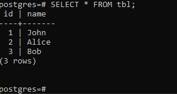

# Indeksy,  optymalizator <br>Lab 6-7

<!-- <style scoped>
 p,li {
    font-size: 12pt;
  }
</style>  -->

<!-- <style scoped>
 pre {
    font-size: 8pt;
  }
</style>  -->


---

**Imię i nazwisko:**
Jacek Budny

--- 

## Pierwsze kroki

Stworz instancje serwera w lokalizacji /tmp/test_db (polecenie initdb z opcją -D)

```
initdb.exe -D C:\tmp\test_db
```


Przestaw port na którym uruchomiona będzie ta instancja na 15000
```
initdb.exe -D C:\tmp\test_db
```


Uruchom tą instancję
```
pg_ctl -D "C:\tmp\test_db" -l "C:\tmp\test_db\log.txt" start
```


Połącz się z tą instancją z domyślną bazą postgres
```
psql -p 16000 postgres
```


Utworz tabele tbl o strukturze: int id PK, varchar name
```sql
CREATE TABLE tbl (
    id SERIAL PRIMARY KEY,
    name VARCHAR
);
```
Wyświetl schemat tabeli tbl


Wstaw do tabeli tbl kilka przykładowych rekordów
```sql
INSERT INTO tbl (name) VALUES
    ('John'),
    ('Alice'),
    ('Bob');
```

Pobierz wszystkie rekordy
```sql
SELECT * FROM tbl;
```




Zatrzymaj instancje test_db

```
pg_ctl -D "C:\tmp\test_db" stop
```
